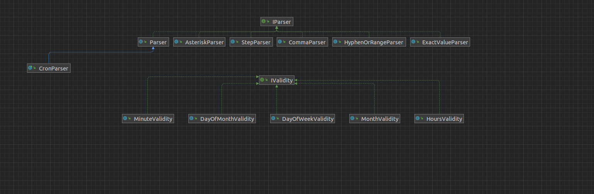

#### Please refer the document steps-to-execute.md for steps to execute the program.

## Documentation - Cron parser

### Input format 
#### "minute" "hour" "day of month" "month" "day of week"

## Input constraints

- Minute Input format (0-59)
- Hour input (0-23)
- Day of month (1-31)
- Month (1-12)
- Day of week (1-7)

### Input standards - each field can have the following representation 
- specific number (eg: "5")
- multiple numbers - comma separated  (eg: "1,2,3")
- step function x/y (starting from x, occurs after every y) (eg: */4)
- asterisk * (every number in range)
- hyphen (a-b) range from a to b (eg: 2-4)

### Output format

- minute:<will execute for minutes>
- hour:<for these hours>
- day of month:<for these days of month>
- month:<for this months of a year>
- day of week:<for these days of a week>

## Code structure

- CronParser.java is the main entry class.
- The answer is calculated in the parser.Parser.java class.
- It passes the input string given by user and calculates output for each of the required fields based on specific way of input (hyphen, asterisk etc.)
- Each field has a validity, as described in above input format standards.

### Resources:
resources used: https://elmah.io/tools/cron-parser/