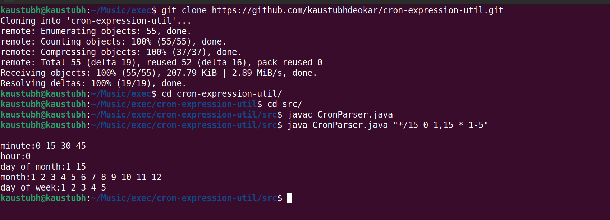

### Steps to execute the program

1. Clone this repo
```
git clone https://github.com/kaustubhdeokar/cron-expression-util.git
```
2. Go to the src/ directory
3. Type the following command to compile the java files
```
javac CronParser.java
```
4. Execute a testcase with the following command
```
java CronParser.java "<cron-expression>"
```


